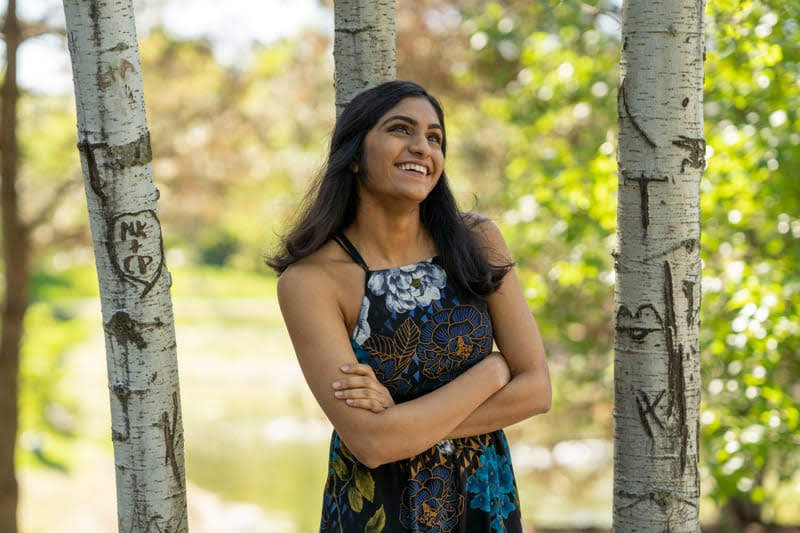

## NAME

Drshika Asher *(she/they)*
{: .section-content}


{: .section-content}

## SYNOPSIS

**Industry:**
NCSA [Research SWE][2024]   
MongoDB [SWE Intern][2023]   
Uber [SWE Intern][2023]   
Cargill [SWE Intern][2022]   
EnterpriseWorks [Front-End Intern][2021]  
{: .section-content}

**Education:** UIUC, B.S. Computer Science [2024]
{: .section-content}

**Research:**  
Microsoft Research Redmond [Undergrad Research Intern][2022]   
Social CompUting LaBoratory (SCUBA) [Research Intern][2021][2022]    
Human Computer Interaction Lab [Research Intern][2022]    
{: .section-content}

## DESCRIPTION 

Hey, I'm Drshika! I recently graduated from UIUC and moved to New York. Currently, I'm a Research Software Engineer at the National Center for Supercomputing Applications. I was born and raised in the suburbs of Chicago, Illinois and the city holds such a special place in my heart that I have a [Spotify playlist](https://open.spotify.com/playlist/0GOlx5tIU2eruC47yMRmrO?si=35f55188f7744fd9) dedicated to it. 
{: .section-content}

During college, I was involved with a lot of undergraduate research, head TA-ships (or as the CS department at UIUC calls them, CA-ships) and club leadership. My studies and research were supported by scholarships from JP Morgan Chase, Bank of America, Cargill, Clare Boothe Luce Foundation and others. To add some spice to my life, I spent my senior year in college interning for [Japan House](https://japanhouse.illinois.edu/) where I whisked countless bowls of matcha and learned to dress in Yukata!
{: .section-content}
 
When I'm not coding, you can find me playing trivia with my friends, practicing hindustani classical music, teaching myself to embroider or curating hyper-specific playlists on Spotify. 
{: .section-content}

## [NEWS](#news)

[August, 2024]
{: .news-header}
I graduated and moved to NYC! Here's to new beginnings :) 
{: .news} 

[May, 2024] 
{: .news-header} 
I'm super honored to be recognized by the UIUC CS department for my research and scholarship. Learn more [here](https://siebelschool.illinois.edu/news/2024-celeb-excel)
{: .news} 

[→ Read older news](/news-archive)

## RESEARCH

**OVER-TRUST IN AUTOMATED SYSTEMS, UIUC HCI LAB** [2022]
{: .sub-header}

*Mentors: Prof. Alex Kirlik and Sebastian Rodriguez*. I worked with the UIUC Human-Computer Interaction lab on a project about embodied agents in the context of trust, performance, and embodiment in a physical VR task. I contributed ideas in terms of shaping experimental design, researched and analyzed papers to the review of literature and helped design the VR game itself by programming in C# and Unity. I also dry ran the experiment with peers until it was ready to execute at a larger scale. 
{: .section-content}

**CLASSIFYING AUDIO-SOCIAL PLATFORMS,SCuBa LAB** [2021]
{: .sub-header}

*Mentors: Prof. Eshwar Chandrashekaran and Tanvi Bajpai*. I investigated the structure and norms of the voice based platform Clubhouse and documented the different forms of abuse on voice based platforms like Twitter Spaces, Discord Stages as well as Spotify Greenroom. We analyzed these trends using Natural Language Processing techniques like LDA and SAGE. See my talk from the virtual REU poster session [here](https://cs.illinois.edu/research/undergraduate-research/summer-research-experience-undergraduates/participants/drshika-asher)
{: .section-content}

**PUBLICATIONS**   
Validating trust in human-robot interaction through virtual reality: Comparing embodied and "behind-the-screen" interactions   
Sebastian Rodriguez, Harsh Deep, **Drshika Asher**, James Schaffer, Alex Kirlik, USA (accepted, AHFE 2023) \[[arxiv](https://openaccess.cms-conferences.org/publications/book/978-1-958651-93-3/article/978-1-958651-93-3_9)\]
{: .section-content}

Harmonizing the Cacophony: An Affordance-aware Framework of Audio-Based Social Platform Moderation   
Tanvi Bajpai, **Drshika Asher**, Anwesa Goswami, and Eshwar Chandrasekharan
Preprint, July 2021. (accepted, ACM CSCW 2022) [[arXiv](https://arxiv.org/abs/2107.09008)]
{: .section-content}

## INDUSTRY

**MONGODB**, Software Engineering Intern [2023]
{: .sub-header}

I was on the Database Experience - Rust Driver Team where I worked on an API endpoint for the open source MongoDB rust driver available here: [https://github.com/mongodb/mongo-rust-driver](https://github.com/mongodb/mongo-rust-driver). I also updated 10 tests, fixed 3 bugs and updated pages of documentation across the rust-driver and bson-rust repository. 
{: .section-content}

**UBER**, Software Engineering Intern [2023]
{: .sub-header}

I was on the Membership Platform Team where I wrote a high-performance Golang REST API endpoint that serves 60k queries per second (QPS). I was able to decrease latency by 36.2% for three flows. 
{: .section-content}

**CARGILL**, Software Engineering Intern [2022]
{: .sub-header}

I was a software engineering intern with the Cargill Innovation lab where I collaborated with international stakeholders to build a unified React component library.
{: .section-content}

**ENTERPRISEWORKS**, Front-End Developer [2021]
{: .sub-header}

Over the summer of 2021, I had my first internship with EnterpriseWorks, a startup incubator. I build over 20 pages of websites for both internal and external clients and got fluent with HTML, CSS, JS and PHP! This internship was an amazing learning experience for me and I really enjoyed working with the team.
{: .section-content}

## SERVICE, LEADERSHIP & TEACHING

**teaching** (* == admin/head course assistant (CA))

**CS225: DATA STRUCTURES**[SP2022][FA2022*]
{: .sub-header}

Data Structures and Algorithms in C++. With G. Carl Evans and Brad Solomon. 
{: .section-content}

[0] [Exam 1 Review Guide](https://drshika.notion.site/Exam-1-Review-8222916da8114aceafafcd25db66dccc)   
 &nbsp;↓    
[1] [Exam 2 Review Guide](https://drshika.notion.site/Exam-2-Review-b9f8acdc9c64470080ce7f42105134d4)   
 &nbsp;↓   
[2] [Exam 3 Review Guide](https://www.notion.so/drshika/Exam-3-Review-cd5493319d2545d2b099dc10a690ec31)   
 &nbsp;↓     
nullptr 
{: .section-content}

**CS196: COMPUTER SCIENCE HONORS** [SP2021*][FA2021]
{: .sub-header}

CS 196 is a student-run freshman honors section for ‘Intro to Computer Science’ at UIUC. Was Project Manager for two teams using Scrum to help build and ship two Kotlin Apps.
{: .section-content}

[0] [Kotlin Slides](https://docs.google.com/presentation/d/1efdbPEUBnE5P_QJIuWO4aWLMJm2U5TwSn668uMNahi8/edit?usp=sharing)   
 &nbsp;   ↓   
nullptr 
{: .section-content}

**service**

**NCWIT ASPIRATIONS IN COMPUTING REGIONAL ORGANIZER** [2022][2023]
{: .sub-header}

Reviewed applications for the NCWIT AiC award and lead the organization of the AiC award Ceremony for the Central Illinois Affiliate.
{: .section-content}

**ILLINOIS CS STARS RESEARCH FELLOW** [2021-22]
{: .sub-header}

Worked on recruiting, mentorship and cohort-building activities like Hour of Code, [ChicTech](https://cs.illinois.edu/news/chictech-created-an-encouraging-computing-environment-for-high-school-students), [Trick or Research](https://cs.illinois.edu/news/trick-or-research-event-broke-down-barriers-to-undergraduates-in-research) and Admitted Women’s outreach.
{: .section-content}

**leadership**

**[ACM @ UIUC](https://acm.illinois.edu/)**, Corporate Chair [2022], Social Media Chair [2021]
{: .sub-header}

As the Corporate Chair for Association of Computing Machinery at Illinois, I mentored a lead a team of 6 to raise $10,000+ in funding for our club during COVID-19. Additionally, I served as a mentor this summer to incoming freshman.
{: .section-content}

**[Reflections \| Projections](https://www.reflectionsprojections.org/)**, Content Chair [2021]
{: .sub-header}

Was a Content Chair for Reflections \| Projections, a hybrid conference created to introduce students to careers in computing. Our team of 6 brought in a total of 11 speakers across 9 speaking events for students to hear about how they can leverage computing for good across a variety of fields ranging from ethical artificial intelligence to project management. Keynote: D. Sivakumar ex head of AI @ Google
{: .section-content}

## **EXTRAS**



{: .section-content}
<figcaption alt="Drshika is gazing up and smiling at the sun shining through the trees">this is me looking at well documented code ;)</figcaption>
{: .section-content}