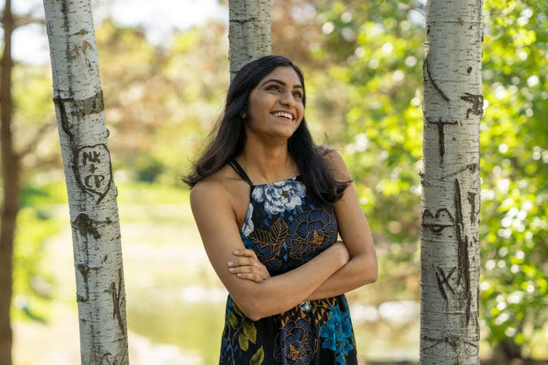

## NAME

Drshika Asher *(she/they)*

[<a href="assets/css/files/asher_drshika_resume.pdf">Resume</a>][<a href="assets/css/files/asher_drshika_cv.pdf">CV</a>]

 

[LinkedIn:<a href="https://www.linkedin.com/in/drshikaasher/">@drshikaasher</a>][Twitter:<a href="https://twitter.com/drshika_">@drshika_</a>][Github:<a href="https://github.com/drshika">@drshika</a>]

 

[drshika2(at)illinois(dot)edu]
 

## SYNOPSIS
**Education:** Computer Science, Hoeft T&M XXVIII [Expected-2024]

**Industry:**
Uber [SWE Intern][2023]   
Cargill [SWE Intern][2022]   
EnterpriseWorks [Front-End Intern][2021]  

**Research:**  
Microsoft Research Redmond [Undergrad Research Intern][2022]   
Social CompUting LaBoratory (SCUBA) [Research Intern][2021][2022]    
Human Computer Interaction Lab [Research Intern][2022]    

## DESCRIPTION 

My name is Drshika. I’m a (currently on hiatus) 16th grade student at the University of Illinois Urbana-Champaign studying Computer Science with a minor in technology and management. 

I’m interested in learning more about Virtual/Augmented Reality, Accessibility, and Social Computing and have been researching with the HCI and SCuBa laboratory through the Clare Boothe Luce and CS STARS Research Fellowship. 

My studies and research are supported by scholarships from JP Morgan Chase, Bank of America, Cargill, Clare Boothe Luce Foundation and others.

I love to help others and was a head course assistant for CS225 (Data Structures) and CS196 (honors computer science).

In my free time, I indulge in singing hindustani classical music, biking on local trails, and attempting to cook various deserts.

## [NEWS](#news)

[September, 2022]
 Thanks to Bank of America and Rewriting the Code for providing me with a scholarship to attend the Grace Hopper Conference in Orlando, Florida!

[August, 2022]
 I'm super excited to be one of 30 RTC Rising Student Leaders for this academic year! I'll be the leader for the Gaming Interest group and will be hosting a lot of cool sessions and workshops with them.

[May, 2022]
 I'll be travelling to Minneapolis this summer! I was selected for the 2022 Cargill Global Scholars Program. Learn more [here](https://www.cargillglobalscholars.com/)

[-> Read older news](/news-archive)

## RESEARCH

   
<b>OVER-TRUST IN AUTOMATED SYSTEMS,</b> UIUC HCI LAB [2022]

*Mentors: Prof. Alex Kirlik and Sebastian Rodriguez*. I worked with the UIUC Human-Computer Interaction lab on a project about embodied agents in the context of trust, performance, and embodiment in a physical VR task. I contributed ideas in terms of shaping experimental design, researched and analyzed papers to the review of literature and helped design the VR game itself by programming in C# and Unity. I also dry ran the experiment with peers until it was ready to execute at a larger scale. 

   
<b>CLASSIFYING AUDIO-SOCIAL PLATFORMS,</b>SCuBa LAB [2021]

*Mentors: Prof. Eshwar Chandrashekaran and Tanvi Bajpai*. I investigated the structure and norms of the voice based platform Clubhouse and documented the different forms of abuse on voice based platforms like Twitter Spaces, Discord Stages as well as Spotify Greenroom. We analyzed these trends using Natural Language Processing techniques like LDA and SAGE. See my talk from the virtual REU poster session [here](https://cs.illinois.edu/research/undergraduate-research/summer-research-experience-undergraduates/participants/drshika-asher)

**PUBLICATIONS**

Harmonizing the Cacophony: An Affordance-aware Framework of Audio-Based Social Platform Moderation
Tanvi Bajpai, **Drshika Asher**, Anwesa Goswami, and Eshwar Chandrasekharan
Preprint, July 2021. (accepted, ACM CSCW 2022) [[arXiv](https://arxiv.org/abs/2107.09008)]

## INDUSTRY
   
<b>UBER</b>, Software Engineering Intern [2023]

I'm excited to be starting my internship with the Uber Eats engineering team in San Francisco!

   
<b>CARGILL</b>, Software Engineering Intern [2022]

I was a software engineering intern with the Cargill Innovation lab where I collaborated with international stakeholders to build a unified React component library.

   
<b>ENTERPRISEWORKS</b>, Front-End Developer [2021]

Over the summer of 2021, I had my first internship with EnterpriseWorks, a startup incubator. I build over 20 pages of websites for both internal and external clients and got fluent with HTML, CSS, JS and PHP! This internship was an amazing learning experience for me and I really enjoyed working with the team.

## PROJECTS

   
<b>TANPURA APP</b> --github_link=<a href="https://github.com/drshika/tanpura-app">https://github.com/drshika/tanpura-app</a>

I developed a virtual Tanpura Simulator with 7 keys using Cinder’s Audio API Library. Used C++, Cinder, and CMake.

   
<b>HANDWRITING CLASSIFIER</b>

I created a model using the Naive-Bayes Classifier algorithm to predict the number that a user draws on a sketchpad. I trained the model with 5000 handwritings, and tests the model with 1000 handwritings with an accuracy of 98%. Since this was a school project, I cannot link the code. Used C++, Cinder, and CMake.

   
<b>LCTRS</b> --github_link=<a href="https://github.com/CS196Illinois/Group6">https://github.com/CS196Illinois/Group6</a>

I prototyped a tool to summarize lecture transcripts to assist students in online learning. We fine-tuned the T-5 Small model to summarize conversational academic content. I designed and built a front-end user interface with Flask and Google OAuth for users to store their past summarized transcripts.

## SERVICE, LEADERSHIP & TEACHING

<body><b>teaching</b> <i>(* == admin/head course assistant (CA))</i></body>
   

<b>CS225: DATA STRUCTURES</b>[SP2022][FA2022*]

Data Structures and Algorithms in C++. With G. Carl Evans and Brad Solomon. 

[0] [Exam 1 Review Guide](https://drshika.notion.site/Exam-1-Review-8222916da8114aceafafcd25db66dccc)   
 &nbsp;↓    
[1] [Exam 2 Review Guide](https://drshika.notion.site/Exam-2-Review-b9f8acdc9c64470080ce7f42105134d4)   
 &nbsp;↓   
[2] [Exam 3 Review Guide](https://www.notion.so/drshika/Exam-3-Review-cd5493319d2545d2b099dc10a690ec31)   
 &nbsp;↓   
[3] [(wip) Class Texbook](https://drshika.github.io/cs225-coursebook/)   
 &nbsp;↓  
nullptr 

   
<b>CS196: COMPUTER SCIENCE HONOR</b> [SP2021*][FA2021]

CS 196 is a student-run freshman honors section for ‘Intro to Computer Science’ at UIUC. Was Project Manager for two teams using Scrum to help build and ship two Kotlin Apps.

[0] [Kotlin Slides](https://docs.google.com/presentation/d/1efdbPEUBnE5P_QJIuWO4aWLMJm2U5TwSn668uMNahi8/edit?usp=sharing)   
 &nbsp;   ↓   
nullptr 

<body><b>service</b></body>

   
<b>NCWIT ASPIRATIONS IN COMPUTING REGIONAL ORGANIZER [2022]</b>

Reviewed applications for the NCWIT AiC award and lead the organization of the AiC award Ceremony for the Central Illinois Affiliate.

   
<b>ILLINOIS CS STARS RESEARCH FELLOW [2021-22]</b>

Worked on recruiting, mentorship and cohort-building activities like Hour of Code, [ChicTech](https://cs.illinois.edu/news/chictech-created-an-encouraging-computing-environment-for-high-school-students), [Trick or Research](https://cs.illinois.edu/news/trick-or-research-event-broke-down-barriers-to-undergraduates-in-research) and Admitted Women’s outreach.

<body><b>leadership</b></body>

   
<b><a href="https://acm.illinois.edu/">ACM @ UIUC</a></b>, Corporate Chair [2022], Social Media Chair [2021]

As the Corporate Chair for Association of Computing Machinery at Illinois, I mentored a lead a team of 6 to raise $10,000+ in funding for our club during COVID-19. Additionally, I served as a mentor this summer to incoming freshman.

   
<b><a href="https://www.reflectionsprojections.org/">Reflections | Projections</a></b>, Content Chair [2021]

Was a Content Chair for Reflections \| Projections, a hybrid conference created to introduce students to careers in computing. Our team of 6 brought in a total of 11 speakers across 9 speaking events for students to hear about how they can leverage computing for good across a variety of fields ranging from ethical artificial intelligence to project management. Keynote: D. Sivakumar ex head of AI @ Google

## **EXTRAS**

[0] I’m in the top .01% of listeners for Chloe X Halle   
 &nbsp;↓   
[1] I like to build mechanical keyboards! I use the rk68 with gat milky yellows   
 &nbsp;↓   
[2] My favorite foods are lychee and basil pesto pasta   
 &nbsp;↓   
[3] My favorite shows are Ted Lasso, The Good Place and Parks and Recreation :)   
 &nbsp;↓   
[4] Here’s a picture of me!    
 &nbsp;↓   
nullptr

<figcaption alt="Drshika is gazing up and smiling at the sun shining through the trees">this is me looking at well documented code ;)</figcaption>
